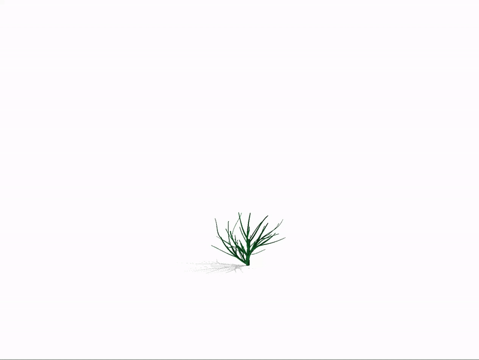
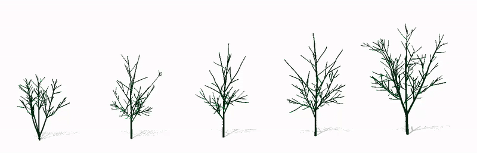
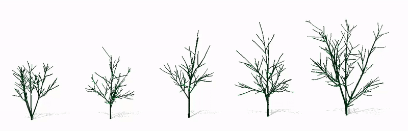
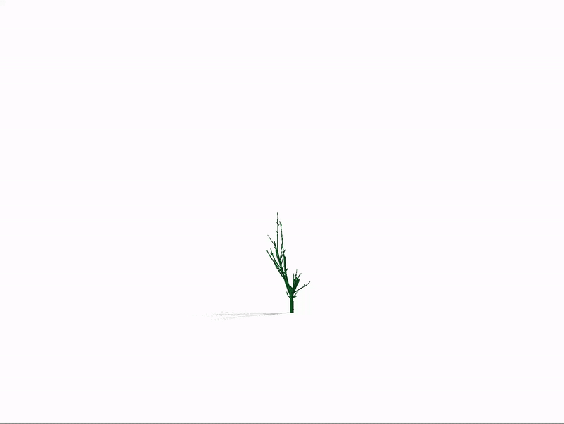

This is an example code for the paper **A Riemannian Framework for the Elastic  Analysis  of the Spatiotemporal Variability in the Shape and Structure of Tree-like 4D Objects**

Detailed results can be found on our [project website](https://4dtreeshapegeometry.github.io)

**Step-by-step-guide:**

First, compile DynamicProgrammingQ.c using mex command in matlab: **mex DynamicProgrammingQ.c**

**Step 1: pre-processing**

We extracted the skeleton from the meshes of 4D tree models we obtained from Globe plants and stored it in the ‘NeuroData’ folder. In the folder, the models are represented by a skeleton point cloud and a radius at each point. 

Run **Branching_layers.m** to visualize the skeleton of a 4D tree model with branch layers represented in different colours.

Run **Visualize_geometry.m**  to visualize the geometry of a 4D tree model.

**Step 2: Spatio-temporal registration**

**Before spatial registration**
 

**After spatial registration**

We have performed the spatial registration within each sequence first. Then, set up spatial correspondence across 4D sequences. Finally, we align 4D sequences onto other sequences temporally,

Run **Spatio_temporal_registration_between_two.m** to visualize the output of spatiotemporal registration between two 4D sequences at the skeleton level, where the color code represents the correspondences. 

To perform spatiotemporal registration in a set of 4D sequences, Run **Spatio_temporal_reg**.

However, the registered 4D trees of our three different sets are saved in ‘Registered_data/Set1_reg_to1(p=0.5)’ (Set 1), ‘Registered_data/ all_lamda=1(L3,3-9), Set2’ (set 2), ‘Registered_data/ all_lamda=1(4(L3)-8(L4)), Set3’ (Set 3)

**Step 3: Geodesic computation**

Run **Geodesic_computation_before_reg.m** to visualize the geodesic path between two 4D tree models before performing spatiotemporal registration.

Run **Geodesic_computation_after_reg.m** to visualize the geodesic path between two 4D tree models after performing spatiotemporal registration.

**Step 4: Summary statistics and random sample synthesis**

Run **Mean_modes_set1.m** to visualize the mean 4D shape and the variation of set1 in the first principal direction of variation. If you explore in other principal directions, the instruction is given in the script.

**Mean shape of set1**

Run **Mean_modes_set2and3.m** to visualize the mean 4D shape and the variation of set2, set3 in the first principal direction of variation.

Run **Synthesize_from_set1** to get random samples by learning from set1

Run **Synthesize_from_set2and3** to get random samples by learning from set2 and set3

**Synthesized 4D tree from set2**

If this repository is useful for your research and you use it, please cite.

<section class="section" id="BibTeX">
  

    <h2 class="title">BibTeX</h2>
    <pre><code>@article{,
  author    = {Tahmina Khanam, Hamid Laga, Mohammed Bennamoun, Guanjin Wang, Ferdous Sohel, Farid Boussaid, Anuj Srivastava},
  title     = {A Riemannian Framework for the Elastic  Analysis  of the Spatiotemporal Variability in the Shape and Structure of Tree-like 4D Objects},
  journal   = {},
  year      = {},
}</code></pre>
  

</section>
